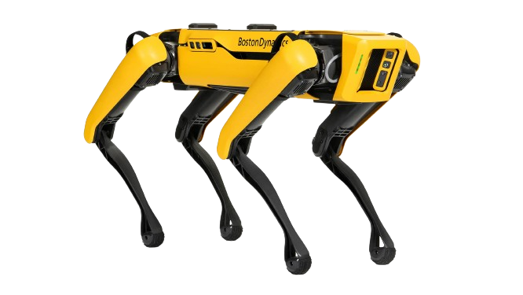

<div align="center">

# SPOT-LSM-survey
Radiation survey with digitized Log Survey Meter (LSM) and Boston Dynamic SPOT robot
 </div>

<p align="center"></p>
<p align="center"></p>

<div align="center" >
<a href="https://github.com/boston-dynamics/spot-sdk"></a>
<a href="https://www.docker.com/"></a>
<a href="https://www.python.org"></a>
<a href="https://labjack.com/"></a>
</div>


## CONCEPTS

## 💎 LOCALIZATION 

SPOT's localization data is essential in providing SPOT's definite locations in the world frame, in relative to where its dock (e.g:(0,0,0) point) is. This data is crucial in helping us identify the location from which we obtain the LSM radiation data from.

SPOT forms its localization via a system of waypoints and edges. Waypoints define named locations in the world, and edges define how to get from one waypoint to another. SPOT Frames and April Tag are fundamental of the localization data. 

### 🥇 SPOT FRAMES 

SPOT's location data is acquired in Odom and Vision Frames. 
Information about SPOT's Geometry and Frames: <https://dev.bostondynamics.com/docs/concepts/geometry_and_frames> 

### 🥈 APRIL TAG

AprilTag is our choice of visual fiducial system for this project. The SPOT SDK includes modules(e.g:```world_object``` in the client library) that enable the implementation of AprilTag to assist SPOT with the establishing of waypoints. 

SPOT detects AprilTags using its base cameras and retrieve the data into the object frame which then will be treated as the ground truth reference object. The Tag plays an essential roles in assiting SPOT navigate through the world in a metrically consistent manner. 

In this project, April Tag assists us with our calibration purposes for localizing SPOT in the world, on top of SPOT's frame system itself. 

## 💎 LSM DIGITIZERS

LSM Digitizers are used to digitize radiation dose readings. There are two options: 
- [LabJack](https://labjack.com/)
- [Mirion](https://www.mirion.com)

All modules and dependencies needed for digitizers have been configured in the Docker Container, see usage below for more info. 

### 📚 LABJACK  

Module Requirements: 
- [Exodriver](https://github.com/labjack/exodriver)
- [LabJackPython](https://github.com/labjack/LabJackPython)

### 📔 MIRION 

Module Requirements: 
- [accurad](https://github.com/fermilab-robotics/AccuRad-PRD)

The `accurad` module is written by members of Fermilab's Robotic Initiative 


## INSTALLATION 

## 📝 REQUIREMENTS 

- Docker 
- Docker Compose >=1.10.0
- SPOT API credentials

## 🚧 BUILD DOCKER IMAGE
1. Clone the repository 

```bash
    git clone https://github.com/fermilab-robotics/SPOT-LSM-survey.git
```

2. Build the Docker image 

```bash 
    cd SPOT-LSM-survey/
    docker build -f .devcontainer/Dockerfile -t spot-lsm . 
```


## USAGE 


First, change the directory to where `docker-compose.yaml` is located. 

```bash 
    cd SPOT-LSM-survey/.devcontainer/
```

Set up your .env file: 
- `.env` file contains all credentials needed to communicate with SPOT 
- See .devcontainer/.env.example for more information. 

Run the container 

```bash 
    docker compose run --rm spot-lsm \
    -a <action-option> -r <radDigitizer-option> 
    
```

- `-a`: optional flag to specify action options that you want to perform on SPOT, more details below. 
- `-r`: optional flag to specify the LSM digitizer that you take rad dose from, default is Mirion.  

All obtained data is located in `src/data_acquisitions/data`


### ⛵ DIGITIZER OPTIONS

- `Mirion`
- `LabJack`

### 📔 EXAMPLE 

Let's take SPOT's localization data when it walks with the Mirion digitizer, then export data to a CSV format file right after (i.e: default option).

```bash 
    docker compose run --rm spot-lsm
```

How about just taking SPOT localization data, with the LabJack digitizer? 

```bash
    docker compose run --rm spot-lsm myusername spot.fnal.gov / 
    -a 1 -r LabJack 
```


## DEVELOPMENT ENVIRONMENT SETUP

If you're intested in modifying the code to test out on SPOT. There are two options to set up the development environment: 
- [Vscode Remote Dev Container](https://code.visualstudio.com/docs/devcontainers/containers)
- [Docker Compose](https://docs.docker.com/compose/)


### :rainbow: REMOTE DEV CONTAINER 

Guideline for SPOT's development environment for this repository's container setting can be found at: <https://github.com/fermilab-robotics/spot-dev-environment> 

1. Install [Dev Containers extension](https://marketplace.visualstudio.com/items?itemName=ms-vscode-remote.remote-containers)
1. From the `command pallete` of vscode, select `Reopen in container`
The image will be built using the Dockerfile in the .devcontainer folder. [devcontainer.json](.devcontainer/devcontainer.json) is referenced to build up the container. 


### :ocean: DOCKER COMPOSE 

1. Modify volume mount directory in docker-compose.yaml

Volume mount is being used for the container so that changes in local repository would be reflected inside the container. 
The very first line of volume mount, currently `/home/lpham/CODE/SPOT-LSM-survey` needed to be changed to an absolute path to where your local cloned repository is located. 

2. Modify the command line in docker-compose.yaml 

- Comment out `command: ["python3","main.py"]`
- Uncomment the last 2 lines. This will ensure that the container will stay up for you to test your code with the current container configurations.

3. Exec into the container

```bash
    cd SPOT-LSM-survey/.devcontainer
    docker compose up -d 
    docker compose exec -it container-spot-lsm /bin/bash
```


  


